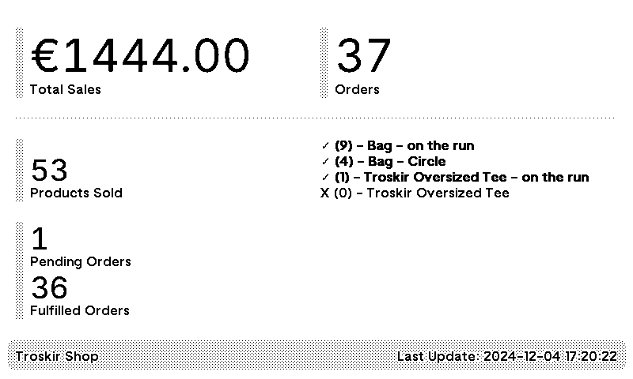

# WooCommerce plugin for TRMNL

A TRMNL plugin that fetches store data from WooCommerce API and displays it.
The following data is displayed:
- Total Sales
- Total Orders
- Products sold
- Pending Orders
- Fulfilled Orders
- Stock Overview



## Setup
1. At TRMNL, add a new Private Plugin
2. Choose strategy "Webhook", save the Plugin and copy "Webhook URL"
3. Click "Edit Markup" and populate it with the content of `markup-full.html` and `markup-quadrant.html` file in this directory
4. Create `.env` file in this directory with the following content
```
WC_API_URL = "https://url-to-your-store.com/"
WC_CONSUMER_KEY = "xxxxxxxxxx"
WC_CONSUMER_SECRET = "xxxxxxxxxx"
WEBHOOK_URL = "https://usetrmnl.com/api/custom_plugins/xxxxxxxxx"
DEBUG = False # Set to True for local testing
```
5. Run `main.py` preferably in a cron job

